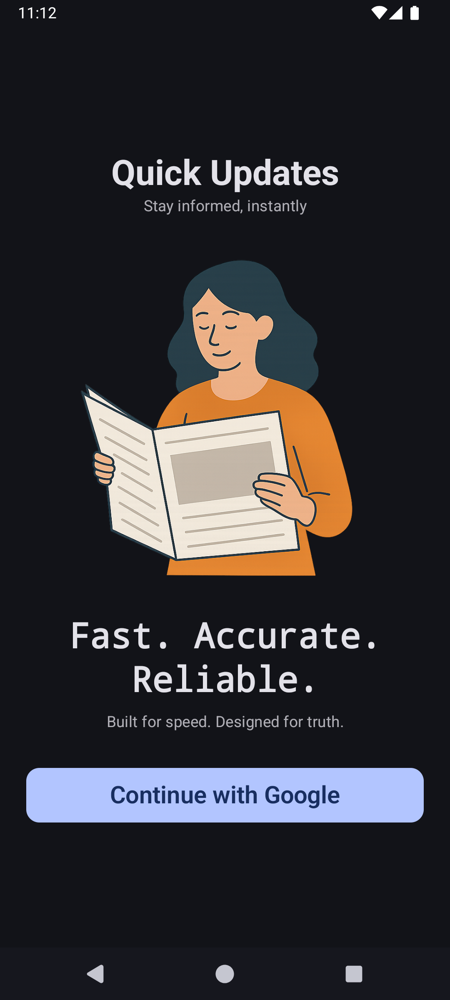
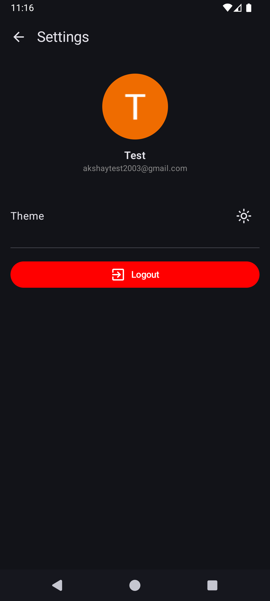
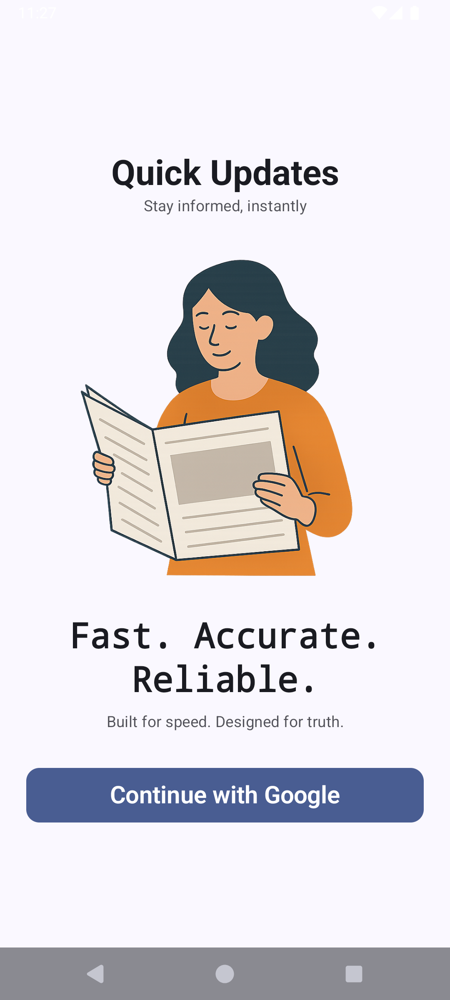
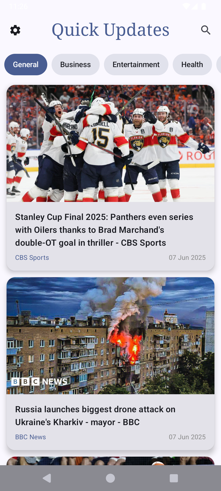
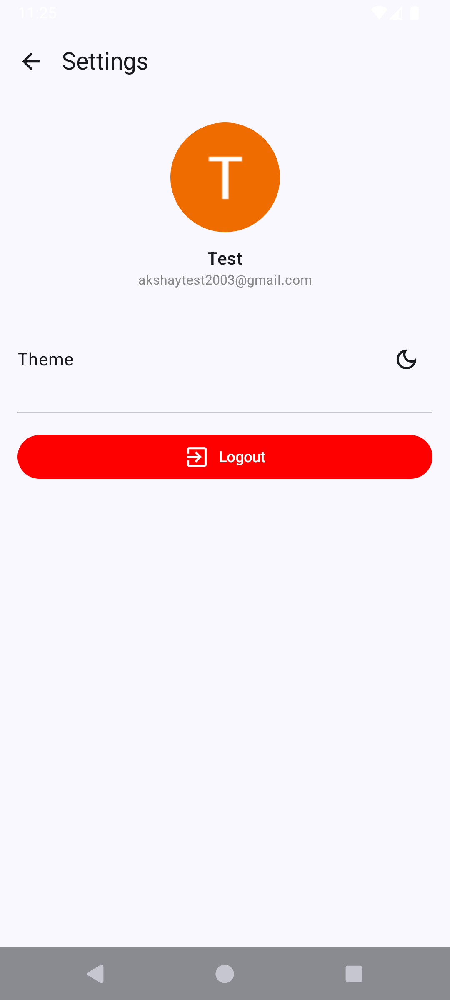

# 📱 Quick Updates - Modern Android News App

**Quick Updates** is a fast and modern Android news application built with the latest Android technologies including **Jetpack Compose**, **Kotlin**, **Hilt**, **Paging 3**, and **NewsAPI**. It delivers real-time breaking news across various categories.

---

## ✨ Features

- 🔐 Firebase Google Sign-In
- 📰 Top Headlines from NewsAPI
- 🔍 Search News Articles
- 🧭 Browse News by Category
- 🌙 Dark Mode Toggle (Persisted using DataStore)
- ♻️ Paging 3 for Infinite Scrolling
- ⚙️ Settings Screen for Customization
- 🔥 Beautiful UI with Jetpack Compose & Material Design 3
- 📡 Online-first experience with error handling and loading states

---

## 📸 Screenshots

### Dark Theme
| Auth Screen                        | Home Screen                        | Search                                 | Settings                                   |
|------------------------------------|------------------------------------|----------------------------------------|--------------------------------------------|
|  |  |  |  |

### Light Theme
| Auth Screen                         | Home Screen                         | Search                                  | Settings                                    |
|-------------------------------------|-------------------------------------|-----------------------------------------|---------------------------------------------|
|  |  |  |  |

---

## 🛠️ Tech Stack

- **Kotlin**
- **Jetpack Compose**
- **Hilt (Dependency Injection)**
- **Firebase Auth**
- **Credential Manager**
- **Jetpack Paging 3**
- **NewsAPI.org**
- **Coil (Image Loading)**
- **DataStore (Preferences)**
- **Coroutines + Flow**
- **MVVM Architecture**

---

## 🚀 Getting Started

### Prerequisites

- Android Studio Flamingo or higher
- Gradle 8.0+
- NewsAPI API Key from [https://newsapi.org](https://newsapi.org)

### Clone the Repository

```bash
git clone https://github.com/akshay-savaliya/QuickUpdates.git